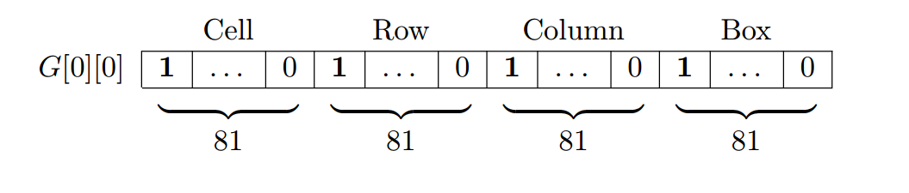
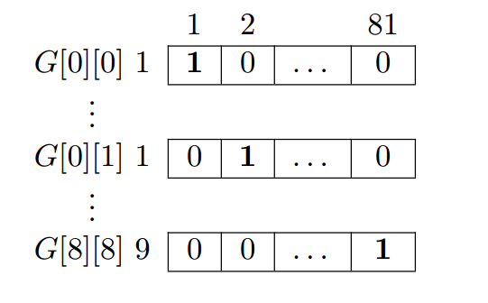
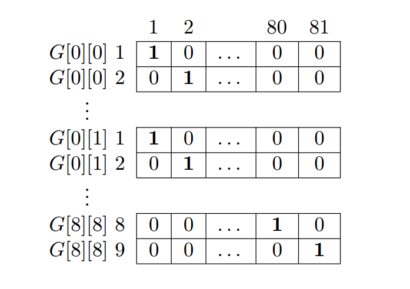
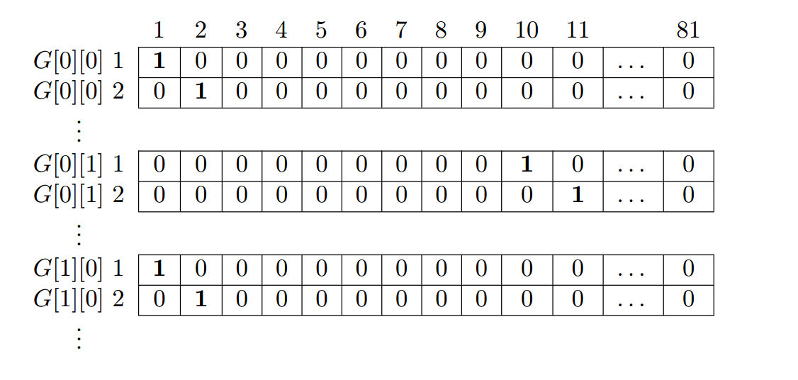
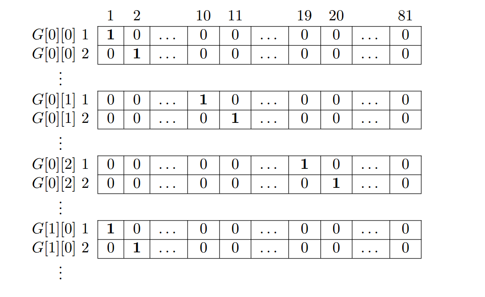

# Reducing Sudoku

* **Cell** Each cell can only contain one integer between 1 and 9.
* **Row** Each row can only contain nine unique integers in the range of 1 to 9.
* **Column** Each column can only contain nine unique integers in the range of 1 to 9.
* **Box** Each box can only contain nine unique integers in the range of 1 to 9

&emsp;&emsp;Consider a grid G with at least 17 clues and with a unique solution. The clues will have an effect on all four constraints since a clue cannot be moved or changed.

&emsp;&emsp;The relationship between the clues will then decide in which cells in the row, column and box the remaining integers can be placed. In other words, the clue determines the candidates for the remaining cells on the same row, column and box.

&emsp;&emsp;The reduction from the grid G must preserve the constraints in a binary matrix M. In M there must then exist a selection of rows such that a union between them covers all columns, otherwise there is no solution.

&emsp;&emsp;This reduction does not seem plausible at first glance since a binary matrix can only contain 1s and 0s, and a grid can only contain integers between 1 and 9. It also does not seem plausible to preserve the constraints for all cells

&emsp;&emsp;What makes this reduction possible is having each row in M describing all four constraint for each cell in G. When a row is chosen from M as part of the solution,what is actually chosen is an integer which complies with all four constraint for the cell in G that the row describes. Each cell in G creates rows as follows though the constraints can come in any order as long as they are consistent for all rows. The following sections describes how each constraint is preserved in M.

## Cell Constraint
&emsp;&emsp;Each cell in G has nine candidates which means there must be nine rows in M for each cell. One of these nine rows must be included for the solution for each cell.Since the solution must cover all columns, each of the nine rows has 1s in their own column. The first cell has 1s in the first column for the first nine rows, the second cell has 1s in the second column for the next nine rows and so on for the remaining cells. This will force the algorithm to always include at least one of the rows for each cell to cover all columns. Since there are 81 cells, there are 81 columns required for the cell constraint, and since each cell requires nine rows, M must have space for its 9 * 81 = 729 rows.

## Row Constraint
&emsp;&emsp;Each row in G can only have a set of integers between 1 and 9. To preserve this constraint in M, the 1s are placed in a different pattern than in the cell constraint.For 9 cells to comply with a row constraint, we need to place the 1s for one row in G over 9 rows in M.

&emsp;&emsp;For one cell in G the 1s are placed in a new column for each of the nine rows in M. This is repeated in the same columns for the first nine cells in G or the 81 first rows in M. The next row constraint starts in the 10th cell or on row 82, but the 1s are placed starting after the last column used by the first row in M. This will force the algorithm to only pick a unique integer value for each cell in the row since the columns with 1s spans the same columns for the cells on the same row, but only one column can be in the solution.

## Column Constraint
&emsp;&emsp;Like the rows in G, the columns in G can only have a set of integers between 1 and 9. To preserve this constraint from G in M, the 1s are again placed in a different pattern in M.

&emsp;&emsp;For every cell in G the 1s are placed in a new column for each of the nine rows in M. This is repeated for the second cell, though instead of reusing the same columns like for the row constraint, the 1s are starting where the previous cell ended. This
occurs for the first nine cells. For the upcoming nine cells, the pattern starts at the first column again. This will pair up the columns of 1s in M with each cell in a column in G. This is going to force the algorithm to only pick a unique integer value for each cell in the column of G.

## Box Constraint
&emsp;&emsp;The box constraint will follow, just like the previous three constraints, a certain pattern. Each box contains three rows and three columns; this will create what would seem to be an irregular pattern at first.

&emsp;&emsp;The first three cells in G will share the same columns of 1s in M. The next three cells in G will share the same columns of 1s, and the last upcoming three cells for that row will also share the same columns of 1s. This is because the nine cells on the first row in G are located in three different boxes. The same pattern is repeated for all rows in G.

&emsp;&emsp;This will create the constraint for three complete boxes. Their columns are equal in M if they are in the same box in G. For one cell in G the columns are placed just like in the row constraint in M, first a 1 in the first column, then a 1 in the second column for the second row in M and so on until the next cell in G. This happens because the integers in the box must have nine unique integers ranging from 1 to 9. This will force the algorithm to once again select rows based on the constraint in the grid.

&emsp;&emsp;This will create the constraint for three complete boxes. Their columns are equal in M if they are in the same box in G. For one cell in G the columns are placed just like in the row constraint in M, first a 1 in the first column, then a 1 in the second column for the second row in M and so on until the next cell in G. This happens because the integers in the box must have nine unique integers ranging from 1 to 9. This will force the algorithm to once again select rows based on the constraint in the grid.

&emsp;&emsp;This was the last of the constraint. Each constraint will require 81 columns each, which leads to that the total number of columns required in M is 81 * 4 = 324.

## Obtaining a Solution
&emsp;&emsp;Obtaining the solution to the grid is quite easy but, requires a slight modification of DLX. Each data object must also include a field for storing the row placement in the original binary matrix M,because when M is transformed by DLX into the links, there is no way of knowing from the found solution which data object is for which row in M.

&emsp;&emsp;When a solution is found, the list of data objects must be sorted in descending order based on their row number. The solution should have 81 rows, one for each cell in the grid that is being solved. Since our domain is 1 to 9, we will use modulus 9 with every row. Before applying modulus, we must increment the row number with one since the implementation deals with zero-based indices while the solution does not.

&emsp;&emsp;Thus the solution found by DLX can because of this be easily transformed back into the original grid again but without any unknown cells. The grid can then be verified if it complies with the constraints or not.

## Optimization
&emsp;&emsp;It is known that M must be of size 729×324 to store all possible constraints. Each given clue only requires one row in M because we want to force the algorithm to only pick these rows for the solution. For unknown cells we must add rows for each candidate. All rows in M are not required to present the constraint, but if rows are removed from M the structure of M is lost and the solution cannot be obtained. Because of this, the rows that are not needed are instead represented as a row of 0s. This will not affect the solution in any way while still keeping the row numbers in M.

&emsp;&emsp;The problem with this approach is that we are only interested on how the 1s are placed, but the majority of elements in M are 0s. There are a lot of unnecessary iterations when creating the links because the 0s are skipped.

&emsp;&emsp;We propose a better alternative for creating the links. Instead of creating the binary matrix M, the links are created directly. Since the number of columns is always the same and since all columns are needed, the 324 column objects are created and stored in an array. The column objects are still linked together, but the access time to all column objects are now O(1).

&emsp;&emsp;For each new cell in G we create four data objects and link them together. Every new cell would be a row further down in M, so the four created data objects can instead be appended to the column objects. All insertion operation takes O(1) because it is just a matter of changing the pointers, and all column objects can be accessed in O(1) through the array. This means that every new cell takes O(1) to insert as links.

&emsp;&emsp;Note that this is not a reduction to an exact cover problem but rather a reduction directly to DLX.

## Scalability
&emsp;&emsp;The explained reduction is for a standard 9×9 Sudoku, but the same principle can be used for smaller or larger grids. The only change is the number of rows and columns since the constraints are still the same. For example, hexadecimal Sudoku with a 16×16 grid will give us a binary matrix of size 4096×1024. Since the binary matrix has almost 18 times more elements, the optimization could be even more important, but the purposed optimization should have no problem of being applied for any grid of any size.